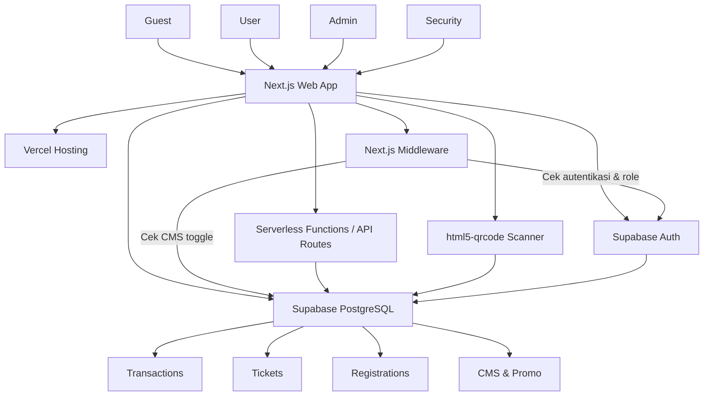
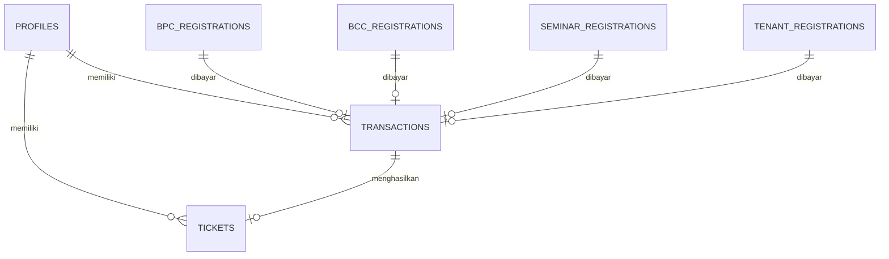
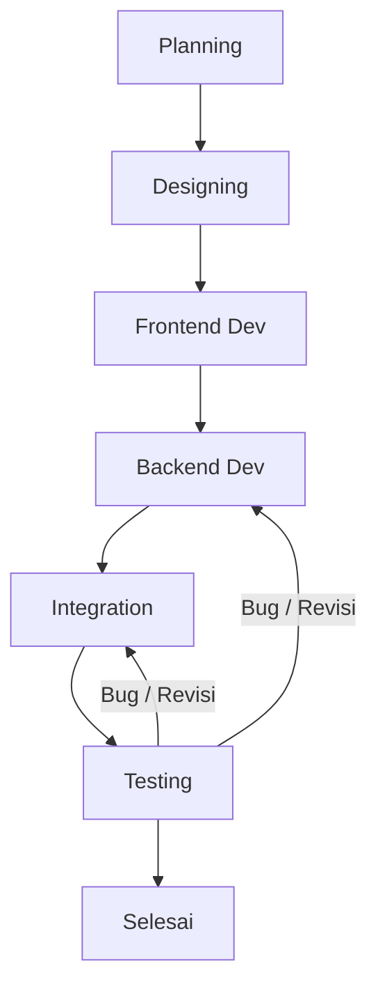

# PRD — Project Requirements Document

**Project:** VOITSFEST Event Web Platform  
**Target:** Fakultas Vokasi ITS  
**Status:** High-Level Product Requirements

---

## 1. Overview

VOITSFEST adalah event tahunan Fakultas Vokasi ITS yang mencakup banyak sub-event: BPC, BCC, Seminar, ColorFun Run (CFR), Tenant, dan Festival. Saat ini pendaftaran, pembayaran, dan pengecekan tiket masih terpisah-pisah sehingga menyulitkan peserta, panitia, dan keamanan.

Platform ini dibangun untuk menjadi satu pintu terpusat dengan aturan akses yang jelas per jenis pengguna. Fitur utama:

- Peserta lomba/tenant/seminar dapat mendaftar **tanpa wajib login** (guest), selama pendaftaran masih dibuka. Setelah submit, pengguna hanya akan melihat pesan konfirmasi **"Your response has been recorded."** tanpa perlu login, dashboard, atau pengecekan status lebih lanjut.
- Pengunjung Festival dan peserta ColorFun Run **wajib membuat akun** untuk membeli tiket.
- Admin keuangan memverifikasi pembayaran dan mengelola data dari **Admin Central**.
- Petugas gate/security memindai QR tiket dengan logika anti-scan-ganda.
- Admin dapat **menutup pendaftaran** sub-event tertentu; halaman pendaftaran yang ditutup otomatis dialihkan ke halaman khusus **Registration Closed**.
- Seluruh rute `/dashboard`, `/admin`, dan turunannya dilindungi: jika pengguna belum login atau perannya tidak sesuai, langsung diarahkan ke halaman login.
- Akun awal untuk Admin dan Security sudah disediakan langsung di sistem (seed), dengan kredensial standar yang wajib segera diganti.

---

## 2. Requirements

Kebutuhan utama proyek ini:

1. **Autentikasi berbasis email unik**
   - Register/login wajib untuk pembeli tiket Festival & ColorFun Run.
   - Email tidak boleh duplikat.
   - Guest yang mendaftar lomba/tenant/seminar tidak perlu login.

2. **Pendaftaran multi-event tanpa login (guest)**
   - Form BPC, BCC, Seminar, dan Tenant dapat diisi langsung oleh guest.
   - Data masuk ke tabel masing-masing dan muncul di Admin Central.
   - Setelah submit, guest **hanya** melihat pesan konfirmasi "Your response has been recorded." – tidak ada dashboard, halaman status, atau notifikasi email. Admin tetap dapat memverifikasi data di belakang tanpa melibatkan guest.

3. **Kontrol buka/tutup pendaftaran lewat CMS**
   - Admin bisa menyalakan/mematikan pendaftaran per sub-event melalui CMS.
   - Saat pendaftaran ditutup, akses ke route pendaftaran (termasuk mengetik manual URL) langsung diarahkan ke `/registration-closed`.
   - Halaman Registration Closed menampilkan pesan dari CMS.

4. **Perlindungan rute untuk pengguna terautentikasi**
   - `/dashboard` hanya bisa diakses oleh user yang sudah login dengan peran `user`.
   - `/admin` dan semua sub-rute di bawahnya (`/admin/*`) hanya bisa diakses oleh peran `admin` atau `security` yang sudah login.
   - Setiap akses ilegal dialihkan ke `/login` dengan pesan “Silakan login terlebih dahulu”.

5. **Verifikasi pembayaran terpusat**
   - Semua pembayaran berbayar masuk ke tabel `transactions`.
   - Admin keuangan mengubah status menjadi `Verified` atau `Rejected`.
   - Saat status Festival/CFR menjadi `Verified`, sistem otomatis membuat tiket dengan token unik.

6. **Tiket QR dengan token teks murni**
   - QR Code berisi token unik, **bukan URL**.
   - Security dashboard memindai token dan mengecek ke database.

7. **Logika anti-scan-ganda "Botol Oli"**
   - Scan pertama: layar hijau, tiket valid, `scan_count` naik menjadi 1.
   - Scan kedua dan seterusnya: layar merah/kuning, muncul riwayat scan pertama.

8. **Admin Central bergaya spreadsheet**
   - Data grid untuk setiap jenis pendaftaran dan transaksi.
   - Fitur search, filter, edit inline, dan export CSV/Excel.

9. **CMS kontrol konten**
   - Admin dapat menyalakan/mematikan: Event Details, Countdown Landing Page, Sponsors List.
   - Admin dapat mengelola promo/bundling untuk tampil di Hot Deals User Dashboard.
   - Admin dapat menutup pendaftaran per sub-event (toggle `registration_open_<event>`).

10. **Role-based access**
    - Guest: akses publik tanpa login.
    - User: pembeli tiket, melihat User Dashboard.
    - Admin: verifikasi pembayaran, kelola data, kelola CMS.
    - Security: membuka Security Dashboard untuk scan tiket.

11. **Akun awal (seed) untuk Admin dan Security**
    - Sistem menyediakan dua akun bawaan saat pertama kali dijalankan.
    - Admin: `admin@voitsfest.id` / password `VoitsAdmin2025!`
    - Security: `security@voitsfest.id` / password `V0itsSecurity!2025`
    - Kedua akun diberi flag `password_change_required = true`; pengguna pertama kali login akan dipaksa mengganti password.

---

## 3. Core Features

- **Pendaftaran BPC & BCC bertahap**  
  Form multi-step (3 langkah) untuk data tim, anggota, proposal, dan berkas lain. Digabung dalam satu halaman per kompetisi. Setelah submit, hanya muncul pesan "Your response has been recorded." tanpa login atau dashboard.

- **Pendaftaran Tenant dengan bukti bayar**  
  Form pengajuan tenant, kategori, dan upload bukti pembayaran sewa. Setelah submit, hanya muncul pesan "Your response has been recorded." tanpa login atau dashboard.

- **Pendaftaran Seminar**  
  Peserta BPC/BPC dikenali otomatis; peserta umum mengisi form biasa. Setelah submit, hanya muncul pesan "Your response has been recorded." tanpa login atau dashboard.

- **Pembelian tiket Festival & ColorFun Run**  
  User login, pilih tiket/paket, upload bukti bayar, dan pantau status di User Dashboard.

- **Payment Verification Center**  
  Admin melihat daftar transaksi Pending, memverifikasi/menolak, dan sistem mencatat verifikator. Verifikasi tidak memicu notifikasi ke guest.

- **Auto-generate tiket**  
  Transaksi Festival/CFR yang sudah `Verified` otomatis menghasilkan token unik `vts-xxxx-xxx`.

- **User Dashboard**  
  Menampilkan tiket yang dimiliki, riwayat transaksi, dan Hot Deals promo/bundling.

- **Security Dashboard**  
  Akses kamera, scan QR token, validasi, dan cegah tiket dipakai dua kali.

- **Admin Central data viewer**  
  Spreadsheet-like UI untuk semua data pendaftaran dan transaksi dengan search, filter, inline edit, export.

- **CMS toggles & promo manager**  
  Atur komponen landing page, promo aktif, dan status buka/tutup pendaftaran per sub-event.

- **Registration Closed Gateway**  
  Halaman khusus `/registration-closed` yang menampilkan pesan bahwa pendaftaran telah ditutup. Dilengkapi tombol kembali ke landing page.

- **Seed Account & Force Password Change**  
  Akun Admin dan Security langsung tersedia setelah inisialisasi database. Login pertama wajib mengganti password.

---

## 4. User Flow

### A. Guest — Pendaftaran Lomba/Tenant/Seminar (saat pendaftaran dibuka)

1. Guest membuka landing page VOITSFEST.
2. Memilih menu event: BPC, BCC, Seminar, atau Tenant.
3. Sistem memeriksa status pendaftaran dari CMS:
   - Jika `registration_open_<event> = false`, tampilkan pesan “Pendaftaran telah ditutup” dan arahkan ke `/registration-closed`.
   - Jika `true`, lanjutkan ke halaman pendaftaran.
4. Guest mengisi form sesuai event.
5. Jika event berbayar, guest mengunggah bukti pembayaran.
6. Sistem menyimpan data ke tabel registrasi dan transaksi berstatus `Pending`.
7. Setelah submit, halaman menampilkan pesan "Your response has been recorded." sebagai konfirmasi akhir. Tidak ada akses lebih lanjut, dashboard, atau notifikasi email. Admin akan memverifikasi di belakang tanpa melibatkan guest.

### B. User — Pembelian Tiket Festival/CFR

1. User klik menu Tiket Festival atau ColorFun Run.
2. Sistem meminta register/login (email unik).
3. User memilih tiket/paket.
4. User mengunggah bukti pembayaran.
5. Sistem membuat transaksi `Pending`.
6. Admin keuangan memverifikasi transaksi.
7. Begitu status `Verified`, sistem otomatis membuat tiket dengan token unik.
8. User membuka User Dashboard (setelah login, dilindungi route).
9. Sistem menampilkan QR Code dari token untuk tiket tersebut.
10. User memakai QR saat masuk gate.

### C. Admin — Verifikasi & Kelola

1. Admin login ke Admin Central.
2. Membuka menu Transactions.
3. Melihat daftar transaksi berstatus `Pending`.
4. Memeriksa bukti pembayaran.
5. Klik `Verified` atau `Rejected`.
6. Jika Festival/CFR diverifikasi, sistem membuat tiket otomatis.
7. Admin dapat membuka data grid BPC, BCC, Tenant, Seminar, dll.
8. Admin dapat mengubah data langsung di tabel, mencari, filter, atau export CSV/Excel.
9. Admin bisa mengatur CMS: menyalakan/mematikan pendaftaran per sub-event, mengelola konten landing page, dan promo.

### D. Security — Scan Tiket di Gate

1. Security login ke Security Dashboard.
2. Mengaktifkan kamera device.
3. Memindai QR Code tiket pengunjung.
4. Sistem membaca token teks.
5. Sistem mengecek token ke tabel `tickets`.
6. Jika token tidak ditemukan → layar merah: **Tiket Palsu**.
7. Jika token ditemukan dan `scan_count == 0` → layar **HIJAU**, tiket valid. Sistem menyimpan `scanned_by`, `scanned_at`, dan `scan_count = 1`.
8. Jika token ditemukan dan `scan_count > 0` → layar **MERAH/KUNING**, muncul peringatan:  
   > *"WARNING: Tiket sudah discan ke-[X] kali. Scan pertama pada [Waktu] oleh [Nama Admin Gate]"*

---

## 5. Route Map & Access Control

Platform terdiri dari 23 halaman dengan aturan akses ketat. Semua URL menggunakan domain `voitsfest.id`.

### Daftar Rute & Aturan

| # | Path | Halaman | Akses | Catatan |
|---|---|---|---|---|
| 1 | `/` | Landing Page | Public |  |
| 2 | `/login` | Login | Public | Redirect ke /dashboard jika sudah login |
| 3 | `/register` | Account Registration | Public |  |
| 4 | `/registration-closed` | Registration Closed | Public | Halaman statis yang menampilkan pesan dari CMS |
| 5 | `/dashboard` | User Dashboard | User (role `user`) | Redirect ke `/login` jika belum login atau role tidak sesuai |
| 6 | `/festival` | Festival Ticket Info | Public | Tampilkan info tiket; cek CMS `registration_open_festival` |
| 7 | `/festival/checkout` | Festival Checkout | User (role `user`) | Wajib login; redirect ke `/login` jika belum |
| 8 | `/colorfun` | ColorFun Run Ticket Info | Public | Cek `registration_open_cfr` |
| 9 | `/colorfun/checkout` | ColorFun Run Checkout | User (role `user`) |  |
| 10 | `/seminar/register` | Seminar Registration | Public (guest) | Cek `registration_open_seminar`; jika false → `/registration-closed` |
| 11 | `/competition/bcc/register` | BCC Registration (Stage 1–3) | Public (guest) | Multi-step form; cek `registration_open_bcc` |
| 12 | `/competition/bpc/register` | BPC Registration (Stage 1–3) | Public (guest) | Multi-step form; cek `registration_open_bpc` |
| 13 | `/tenant/register` | Tenant Registration | Public (guest) | Cek `registration_open_tenant` |
| 14 | `/tenant/payment` | Tenant Payment | Public (guest) | Hanya bisa diakses setelah pendaftaran tenant berhasil? Rincian setelah ada transaksi |
| 15 | `/admin` | Admin Central | Admin (`admin`) | Redirect ke `/login` jika belum login atau role bukan `admin`/`security` |
| 16 | `/admin/security` | Security Dashboard | Security (`security`) | Redirect ke `/login` jika bukan `security` |
| 17 | `/admin/accounts` | Account Data Management | Admin (`admin`) |  |
| 18 | `/admin/competition/bcc` | BCC Data Management | Admin (`admin`) |  |
| 19 | `/admin/competition/bpc` | BPC Data Management | Admin (`admin`) |  |
| 20 | `/admin/colorfun` | ColorFun Run Data Management | Admin (`admin`) |  |
| 21 | `/admin/festival` | Festival Data Management | Admin (`admin`) |  |
| 22 | `/admin/seminar` | Seminar Data Management | Admin (`admin`) |  |
| 23 | `/admin/tenants` | Tenant Data Management | Admin (`admin`) |  |

### Mekanisme Perlindungan Rute

- **Middleware Next.js** akan memeriksa setiap request ke rute yang dilindungi (`/dashboard`, `/admin`, dan sub-rute di bawahnya).
- Jika pengguna tidak memiliki session yang valid (belum login) atau perannya tidak sesuai:
  - Untuk `/dashboard`: alihkan ke `/login?redirect=/dashboard`
  - Untuk `/admin/*`: alihkan ke `/login?redirect=/admin`
- Setelah login berhasil, redirect ke halaman yang diminta.
- **Pengecekan pendaftaran event:** setiap halaman pendaftaran (seminar, bcc, bpc, tenant, festival, cfr) akan memeriksa CMS toggle `registration_open_<event>`.
  - Jika `false`, langsung redirect ke `/registration-closed?event=<nama>`.
  - Halaman `/registration-closed` menampilkan pesan yang diambil dari CMS `registration_closed_message` (contoh: “Pendaftaran Seminar sudah ditutup. Terima kasih atas antusiasme Anda.”).

---

## 6. Architecture

Sistem dibangun dengan **Next.js** sebagai frontend dan backend serverless, **Supabase** untuk authentication, database PostgreSQL, dan storage, serta **Vercel** sebagai hosting.

Alur utama:

- **Next.js Middleware** menangani redirect berdasarkan session role dan status pendaftaran dari CMS sebelum halaman dimuat.
- **Supabase Auth** menangani register/login email dan role.
- **Database PostgreSQL** menyimpan semua data.
- **Serverless Functions/API Routes** menangani logika bisnis.
- **html5-qrcode** dipakai di Security Dashboard.
- **Vercel** untuk deployment.

---

## 7. Database Schema

Database utama memakai PostgreSQL di Supabase. Tabel utama:

### `profiles`
| Kolom | Tipe | Kegunaan |
|---|---|---|
| id | uuid | Primary key, tautan ke Supabase Auth |
| email | text unique | Email login/register |
| full_name | text | Nama lengkap |
| phone | text nullable | Nomor telepon |
| role | text | `user`, `admin`, atau `security` |
| password_change_required | boolean | Default `true` untuk akun seed; paksa ganti password saat login pertama |
| created_at | timestamp | Waktu pendaftaran |

### `bpc_registrations`
| Kolom | Tipe | Kegunaan |
|---|---|---|
| id | uuid | Primary key |
| team_name | text | Nama tim BPC |
| leader_name | text | Nama ketua tim |
| leader_email | text | Email ketua |
| member_names | jsonb | Daftar anggota tim |
| institution | text | Asal institusi |
| proposal_url | text | Link/upload proposal |
| stage | integer | Tahap pendaftaran yang sudah diselesaikan (1-3) |
| status | text | `pending`, `approved`, `rejected` |
| created_at | timestamp | Waktu daftar |

### `bcc_registrations`
| Kolom | Tipe | Kegunaan |
|---|---|---|
| id | uuid | Primary key |
| team_name | text | Nama tim BCC |
| leader_name | text | Nama ketua tim |
| leader_email | text | Email ketua |
| member_names | jsonb | Daftar anggota tim |
| institution | text | Asal institusi |
| proposal_url | text | Link/upload proposal |
| stage | integer | Tahap pendaftaran yang sudah diselesaikan (1-3) |
| status | text | `pending`, `approved`, `rejected` |
| created_at | timestamp | Waktu daftar |

### `seminar_registrations`
| Kolom | Tipe | Kegunaan |
|---|---|---|
| id | uuid | Primary key |
| full_name | text | Nama peserta |
| email | text | Email peserta |
| institution | text | Asal institusi |
| participant_type | text | `bpc`, `bcc`, atau `general` |
| created_at | timestamp | Waktu daftar |

### `tenant_registrations`
| Kolom | Tipe | Kegunaan |
|---|---|---|
| id | uuid | Primary key |
| tenant_name | text | Nama tenant |
| owner_name | text | Nama pemilik |
| email | text | Email tenant |
| phone | text | Telepon tenant |
| category | text | Kategori tenant |
| payment_proof_url | text | Bukti bayar sewa |
| status | text | `pending`, `approved`, `rejected` |
| created_at | timestamp | Waktu daftar |

### `transactions`
| Kolom | Tipe | Kegunaan |
|---|---|---|
| id | uuid | Primary key |
| user_id | uuid nullable | FK ke `profiles.id`; null untuk guest |
| source_type | text | Jenis sumber: `bpc`, `bcc`, `seminar`, `tenant`, `cfr`, `festival` |
| source_id | uuid nullable | ID pendaftaran terkait |
| sub_event_type | text | `BPC`, `BCC`, `SEMINAR`, `TENANT`, `CFR`, `FESTIVAL` |
| amount | numeric | Jumlah pembayaran |
| payment_proof_url | text | Bukti pembayaran |
| status | text | `Pending`, `Verified`, `Rejected` |
| verified_by | uuid nullable | FK ke `profiles.id` admin yang verifikasi |
| verified_at | timestamp | Waktu verifikasi |
| created_at | timestamp | Waktu transaksi dibuat |

### `tickets`
| Kolom | Tipe | Kegunaan |
|---|---|---|
| id | uuid | Primary key |
| token | text unique | Token unik, contoh: `vts-9x8-11a` |
| transaction_id | uuid | FK ke `transactions.id` |
| user_id | uuid | FK ke `profiles.id` |
| event_type | text | `CFR` atau `FESTIVAL` |
| scan_count | integer | Jumlah scan; default 0 |
| scanned_by | uuid nullable | FK ke `profiles.id` security yang scan |
| scanned_at | timestamp nullable | Waktu scan pertama |
| created_at | timestamp | Waktu tiket dibuat |

### `cms_settings`
| Kolom | Tipe | Kegunaan |
|---|---|---|
| key | text primary key | Nama pengaturan, misal `event_details`, `countdown`, `sponsors_list`, `registration_open_seminar`, dll. |
| value | jsonb | Isi pengaturan (bisa boolean, teks, atau objek) |
| updated_by | uuid nullable | FK ke `profiles.id` admin |
| updated_at | timestamp | Waktu update |

**Key tambahan untuk kontrol pendaftaran:**
- `registration_open_festival` (boolean)
- `registration_open_cfr` (boolean)
- `registration_open_seminar` (boolean)
- `registration_open_bcc` (boolean)
- `registration_open_bpc` (boolean)
- `registration_open_tenant` (boolean)
- `registration_closed_message` (text) – pesan yang muncul di halaman `/registration-closed`

### `promos`
| Kolom | Tipe | Kegunaan |
|---|---|---|
| id | uuid | Primary key |
| title | text | Judul promo/bundling |
| description | text | Deskripsi promo |
| discount_type | text | `percent`, `nominal`, `bundling` |
| discount_value | numeric | Nilai diskon |
| is_active | boolean | Status aktif |
| start_date | timestamp | Awal promo |
| end_date | timestamp | Akhir promo |
| created_at | timestamp | Waktu dibuat |

### `sponsors`
| Kolom | Tipe | Kegunaan |
|---|---|---|
| id | uuid | Primary key |
| name | text | Nama sponsor |
| logo_url | text | URL/upload logo |
| is_active | boolean | Status tampil |
| order | integer | Urutan tampil |
| created_at | timestamp | Waktu dibuat |

### Relasi antar tabel

### Seeding Database

Saat database pertama kali dibuat, jalankan seeding untuk memasukkan dua akun:

| Email | Password (hash bcrypt) | Role | password_change_required |
|---|---|---|---|
| admin@voitsfest.id | (hash dari `VoitsAdmin2025!`) | admin | true |
| security@voitsfest.id | (hash dari `V0itsSecurity!2025`) | security | true |

Nilai CMS settings default juga diisi: semua `registration_open_*` di-set `true`, dan `registration_closed_message` berisi pesan netral.

---

## 8. Tech Stack

| Komponen | Teknologi | Alasan |
|---|---|---|
| Frontend | Next.js (React) | Routing, SSR, dan satu codebase untuk frontend + serverless functions |
| Styling | Tailwind CSS | Cepat membangun UI sesuai desain Google Stitch |
| Backend | Next.js API Routes / Serverless Functions | Menangani logika auto-generate tiket, validasi scan, query data |
| Database | Supabase PostgreSQL | Database relasional kuat, cocok untuk data event dan transaksi |
| Authentication | Supabase Auth | Login/register email + role tanpa bangun dari nol |
| Middleware | Next.js Middleware | Perlindungan rute, redirect berdasarkan session role, cek CMS |
| QR Scanner | html5-qrcode | Akses kamera device langsung dari browser untuk scan token |
| Hosting/Deployment | Vercel | Hosting Next.js + serverless functions secara mudah |
| Storage | Supabase Storage | Menyimpan bukti pembayaran, proposal, logo sponsor |
| Seed Data | Supabase CLI / SQL Script | Inisialisasi akun admin dan security default serta CMS settings |

---

## 9. Development Process Flow

Proses pengembangan VOITSFEST Event Web Platform mengikuti tahapan **Planning**, **Designing**, **Frontend Dev**, **Backend Dev**, **Integration**, dan **Testing** dengan loop revisi dari **Testing** kembali ke **Backend** atau **Integration** jika ditemukan kendala. Tahapan Designing sudah selesai, menghasilkan desain Stitch beserta kode HTML dan screenshot.

### Diagram Alur Proses Pengembangan

### Aktivitas dan Output Tiap Tahap

- **Planning**  
  Aktivitas: Menentukan kebutuhan, fitur utama, arsitektur, database, dan rute.  
  Output: Dokumen PRD ini, wireframe, dan daftar API endpoint.

- **Designing** (✅ Sudah Selesai)  
  Aktivitas: Membuat desain antarmuka sesuai Google Stitch, menyusun kode HTML dan screenshot referensi.  
  Output: Desain final Stitch, kode HTML statis, dan aset.

- **Frontend Dev**  
  Aktivitas: Mengonversi kode HTML Stitch menjadi komponen Next.js, menerapkan routing, state management, dan koneksi ke API. Termasuk implementasi middleware untuk perlindungan rute dan pengecekan CMS toggle.  
  Output: Halaman landing, dashboard, admin, dan security yang sudah responsif.

- **Backend Dev**  
  Aktivitas: Membangun API Routes, mengelola database, autentikasi, logika bisnis, integrasi Supabase, dan seeding akun awal.  
  Output: Endpoint API untuk pendaftaran, pembayaran, tiket, scan, CMS, dan route protection.

- **Integration**  
  Aktivitas: Menghubungkan frontend dengan backend, testing integrasi, dan memastikan alur autentikasi serta redirect berjalan.  
  Output: Aplikasi web yang menyatu dan dapat diakses secara penuh.

- **Testing**  
  Aktivitas: Pengujian fungsional, keamanan, performa, dan user acceptance. Jika ditemukan bug, dilakukan revisi ke tahap Backend atau Integration.  
  Output: Aplikasi yang stabil, bebas bug kritis, dan siap rilis.

### Catatan Penting

- **Milestone terkait:** Desain (selesai), Milestone 2: Frontend + Backend Core dan implementasi route protection & seeding, Milestone 3: Integrasi, Milestone 4: Testing & Rilis.
- Proses pengembangan dapat diulang secara iteratif hingga semua fitur berjalan sesuai kebutuhan.